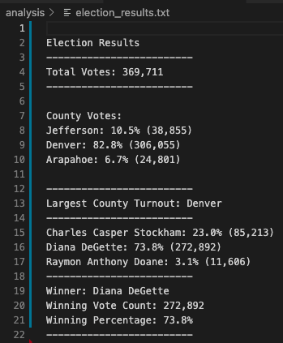

# Election Analysis

## Overview of Election-Audit Challenge
A Colorado Board of Elections employee has given us the following tasks to complete the election audit of a recent local congressional election.

1. The total number of votes cast.
2. A complete list of candidates who received votes.
3. The percentage of votes each candidate won.
4. The total number of votes each candidate won.
5. The winner of the election based on popular vote.

Following these tasks, the Colorado Board of Elections employee had asked us to complete an additional election audit for each county in the precinct for this same election.

1. The voter turnout for each county.
2. The percentage of votes from each county out of the total count.
3. The county with the highest turnout

## Resources
- Data Source: election_results.csv
- Software: Python 3.7.6, Visual Studio Code 1.53.2
- Candidate election audit results referenced from the README file made during the module work: [MODULE README](https://github.com/amirshirazi1/Election_Analysis/blob/main/Module%20Work/README.md)

## Election-Audit Results
- There were 369,711 votes cast in this congressional election in this precinct.
- Each county had the following results:
  - In this precinct, Jefferson county accounted for 10.5% of the vote and 38,855 total votes.
  - In this precinct, Denver county accounted for 82.8% of the vote and 306,055 total votes.
  - In this precinct, Arapahoe county accounted for 6.7% of the vote and 24,801 total votes.
  
County vote totals and percentages found using code on lines 94-100:
```
for county_name in county_votes:

    # 6b: Retrieve the county vote count.
    county_total = county_votes.get(county_name)

    # 6c: Calculate the percentage of votes for the county.
    county_percentage = float(county_total) / float(total_votes) * 100
```

- In this precinct, Denver county saw the highest voter turnout.

Highest voter turnout county determined by using code on lines 110-113:
```
# 6f: Write an if statement to determine the winning county and get its vote count.
if (county_total > largest_turnout):
    largest_turnout = county_total
    largest_county = county_name
```

- There were 369,711 votes cast in the election.
- The candidates were:
  - Charles Casper Stockham
  - Diana DeGette
  - Raymon Anthony Doane
- The candidate results were:
  - Charles Casper Stockham received 23.0% of the vote and 85,213 votes.
  - Diana DeGette received 73.8% of the vote and 272,892 votes.
  - Raymon Anthony Doane received 3.1% of the vote and 11,606 votes.
- The winner of the election was:
  - Diana DeGette - who had received 73.8% of the vote and 272,892 votes.

Results matched from [election_results.txt](analysis/election_results.txt)



## Election-Audit Challenge Summary
Thinking ahead to future elections and how you may want to run similar audits for them, I have good news! Not too much modification will be necessary to our script to work for more elections and on a larger scale.

One change we could make was if you wanted to use this script for a statewide election with many more counties, one of the things we would be able to do is scale the analysis. We could duplicate and modify our code for counting the total county votes to reflect a more generalized category for viewing the results. For example, in the current election, we are focused on one particular precinct's congressional election. For the future election, we could organize results by precinct instead of by county for readability. We could also modify the total votes in all counties count to reflect the total statewide vote count instead.

Another change we could make is if we focused on an election with more public office positions and ballot measures. If this were the case, we could analyze the results of each item. We could modify our code to iterate through the data set and pull out the `(key, value)` pairs of each position or measure to isolate them. After this, we can pass the values through a modified yet similar script to audit the data associated with each of those pairs allowing us to receive the election results for each question on the ballot.
